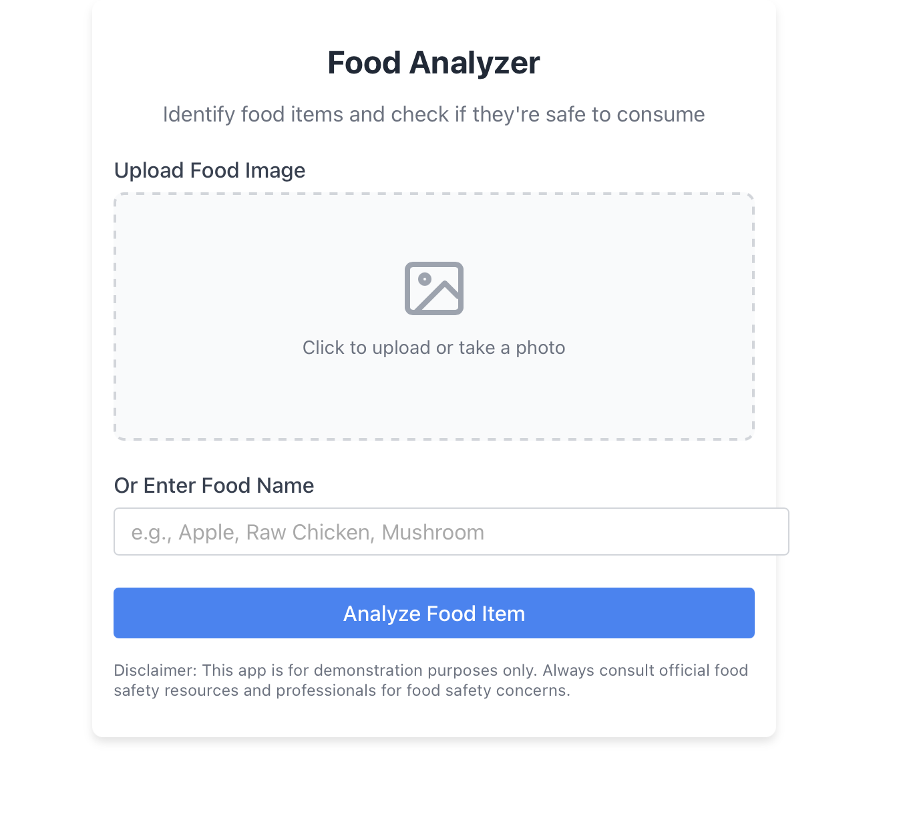

# Food Analyzer

A React application that lets users identify food items and check if they're safe to consume, along with nutritional information.

## Features

- Upload food images or enter food names manually
- Check if a food item is consumable
- Verify if a food item is safe to eat
- View detailed nutritional information
- Get safety warnings for potentially dangerous foods

## Screenshots



## Getting Started

### Prerequisites

- Node.js (version 16.x recommended)
- npm or yarn

### Installation

1. Clone the repository:
```bash
git clone https://github.com/yourusername/food-analyzer.git
cd food-analyzer
```

2. Install dependencies:
```bash
npm install
```

3. Start the development server:
```bash
# Use this command to avoid OpenSSL errors with Node.js 17+
NODE_OPTIONS=--openssl-legacy-provider npm start
```

### Fixing Node.js OpenSSL Errors

If you're using Node.js version 17 or higher, you might encounter the following error:
```
Error: error:0308010C:digital envelope routines::unsupported
```

To fix this, use one of these solutions:

#### Solution 1: Set the Node Options Environment Variable

For Mac/Linux:
```bash
export NODE_OPTIONS=--openssl-legacy-provider
npm start
```

For Windows (Command Prompt):
```cmd
set NODE_OPTIONS=--openssl-legacy-provider
npm start
```

For Windows (PowerShell):
```powershell
$env:NODE_OPTIONS="--openssl-legacy-provider"
npm start
```

#### Solution 2: Update package.json Scripts

Modify your package.json file to include the fix in all scripts:
```json
"scripts": {
  "start": "NODE_OPTIONS=--openssl-legacy-provider react-scripts start",
  "build": "NODE_OPTIONS=--openssl-legacy-provider react-scripts build",
  "test": "NODE_OPTIONS=--openssl-legacy-provider react-scripts test",
  "eject": "NODE_OPTIONS=--openssl-legacy-provider react-scripts eject"
}
```

#### Solution 3: Use Node.js v16

Downgrade to Node.js version 16:
```bash
# If you have NVM installed
nvm install 16
nvm use 16
```

## Project Structure

```
food-analyzer/
│
├── public/
│   ├── index.html
│   └── ...
│
├── src/
│   ├── components/
│   │   ├── FoodAnalyzer.js
│   │   └── FoodAnalyzer.css
│   ├── App.js
│   ├── index.js
│   └── ...
│
└── package.json
```

## Styling

The application uses custom CSS for styling (FoodAnalyzer.css). The styles include:

- Card-based layout with shadows and rounded corners
- Responsive design for various screen sizes
- Color-coded indicators for safety status
- Structured layout for nutritional information

## API Integration

In a production version, you could integrate with food recognition APIs:

- **Bite AI** - Specialized food recognition with extensive database
- **FoodAI** - State-of-the-art food image recognition
- **Clarifai** - Strong capabilities for food identification
- **Google Cloud Vision API** - General image recognition with food detection

For nutritional data:
- **Edamam Food Database API** - Comprehensive food and grocery database
- **Spoonacular API** - Detailed nutritional information with dietary classification

## Future Enhancements

- Real-time image recognition
- Barcode scanning for packaged foods
- Allergy alerts
- Dietary restriction checks
- Recipe suggestions based on identified ingredients
- Food expiration estimation
- Multi-language support

## License

This project is licensed under the MIT License - see the LICENSE file for details.

## Acknowledgments

- Food safety information based on general guidelines
- Mock nutrition data for demonstration purposes only
- Always consult official food safety resources for accurate information